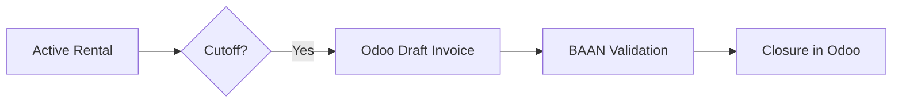

# RP Rental - Phase 2
Executive proposal for billing optimization and traceability.

## Core Objectives
- **Cutoff Billing**: Automated defined periods.
- **Smart Returns**: Exclusive charging of pending days.
- **BAAN Sync**: Odoo-BAAN bidirectional flow.
- **Product History**: Seamless contract consultation.

## Impact
- **Operations**: Efficient navigation and workflow continuity.
- **Finance**: Zero double-charging and draft control.
- **Management**: Full Odoo-BAAN process visibility.

## Overview

## Documentation
- [Scope (PRD)](prd.md)
- [Effort (LOE)](loe.md)
- [Functional (SDD)](software_design_document.md)
