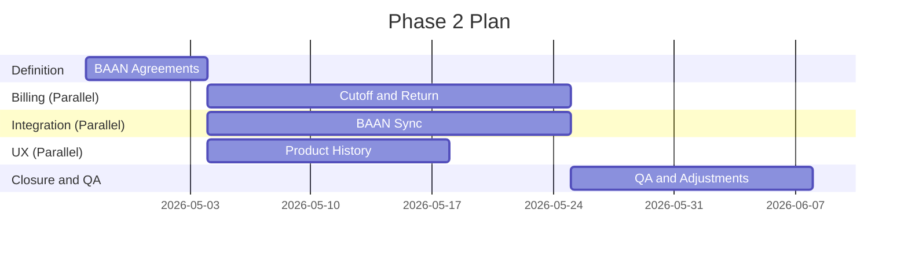

# Estimate and Plan

## 1. Capacity per Front (Parallelism)
- **Band**: `35-45 h/week` per front.
- **Reference**: `40 h/week` (Dedicated per area).
- **Execution**: The plan assumes parallel work across independent fronts.

## 2. Effort by Front
| Front | Base Hours |
| --- | ---: |
| BAAN Alignment and Agreements | 28 |
| Billing Logic (Cutoff/Return) | 82 |
| Odoo-BAAN Integration | 88 |
| UX: Expandable History | 36 |
| QA and Validation | 56 |
| Coordination and Support | 38 |
| Documentation and Closure | 42 |
| **Total** | **370** |

## 3. Delivery Scenarios (Optimized for Parallelism)
- **Lean (Full Parallel)**: 6 to 7 weeks.
- **Recommended**: 8 weeks.
- **Extended**: 10 weeks.

## 4. Weekly Milestones (Simultaneous Execution)
1. **W1**: BAAN Definitions and Alignment (All fronts).
2. **W2-W4**: Parallel Development:
   - Billing (Cutoff and Return).
   - Odoo-BAAN Integration (Sync).
   - UX (Products and History).
3. **W5-W6**: Integrated Testing, QA and Adjustments.
4. **W7**: Closure, Documentation and Production Release.

## 5. Suggested Schedule

