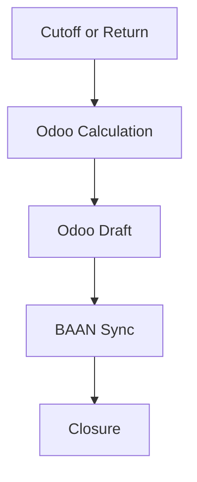
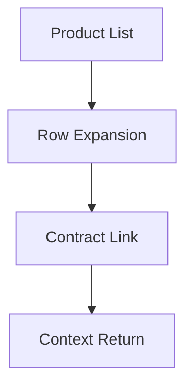

# Needs and Scope

## 1. Summary
Phase 2: Operational-financial cycle closure. Focus on accurate billing and asset visibility.

## 2. Business Objectives
- **Cutoff Billing**: Systematic charging based on defined days.
- **BAAN Synchronization**: Invoice status integration.
- **Asset Traceability**: Contract history accessible from the product list.

## 3. Scope (Value Fronts)

### A. Billing (Cutoff and Return)
- Business rules to trigger draft invoices.
- Automatic calculation of remaining periods for returns.
- Odoo <-> BAAN status exchange (Draft, In Review, Confirmed).

### B. UX and Products
- Expandable rows in `Pumps` and `Hoses/Accessories`.
- Direct access to related contracts.
- Automatic return to previous context (list focus).

## 4. Expected Outcomes
- Reduction in manual billing steps.
- Elimination of double-charging errors.
- Immediate answers regarding equipment availability and history.

## 5. Key Flows

### Billing

### History

