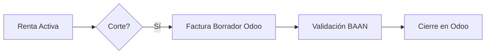

# RP Rental - Fase 2
Propuesta ejecutiva para optimización de facturación y trazabilidad.

## Objetivos Core
- **Facturación por Corte**: Automatización de periodos definidos.
- **Devoluciones Inteligentes**: Cobro exclusivo de días pendientes.
- **Sincronización BAAN**: Flujo bidireccional Odoo-BAAN.
- **Historial en Producto**: Consulta de contratos sin pérdida de contexto.

## Impacto
- **Operación**: Navegación ágil y continuidad de trabajo.
- **Finanzas**: Eliminación de doble cobro y control de borradores.
- **Gerencia**: Visibilidad total del proceso Odoo-BAAN.

## Vista General

## Documentación
- [Alcance (PRD)](prd.md)
- [Esfuerzo (LOE)](loe.md)
- [Funcional (SDD)](software_design_document.md)
