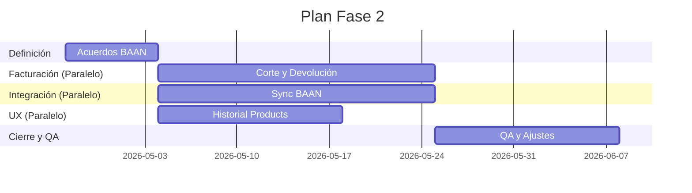

# Estimado y Plan

## 1. Capacidad por Frente (Paralelismo)
- **Banda**: `35-45 h/semana` por frente.
- **Referencia**: `40 h/semana` (Dedicación por área).
- **Ejecución**: El plan asume trabajo en paralelo entre frentes independientes.

## 2. Esfuerzo por Frente
| Frente | Horas Base |
| --- | ---: |
| Alineación y Acuerdos BAAN | 28 |
| Lógica de Facturación (Corte/Devolución) | 82 |
| Integración Odoo-BAAN | 88 |
| UX: Historial Expandible | 36 |
| QA y Validación | 56 |
| Coordinación y Soporte | 38 |
| Documentación y Cierre | 42 |
| **Total** | **370** |

## 3. Escenarios de Entrega (Optimizados por Paralelismo)
- **Lean (Paralelo Total)**: 6 a 7 semanas.
- **Recomendado**: 8 semanas.
- **Extendido**: 10 semanas.

## 4. Hitos Semanales (Ejecución Simultánea)
1. **S1**: Definiciones y Alineación BAAN (Todos los frentes).
2. **S2-S4**: Desarrollo Paralelo:
   - Facturación (Corte y Devolución).
   - Integración Odoo-BAAN (Sync).
   - UX (Productos e Historial).
3. **S5-S6**: Pruebas Integrales, QA y Ajustes.
4. **S7**: Cierre, Documentación y Pase a Producción.

## 5. Cronograma Sugerido

