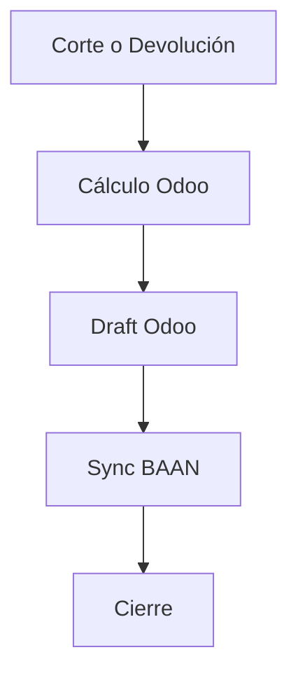
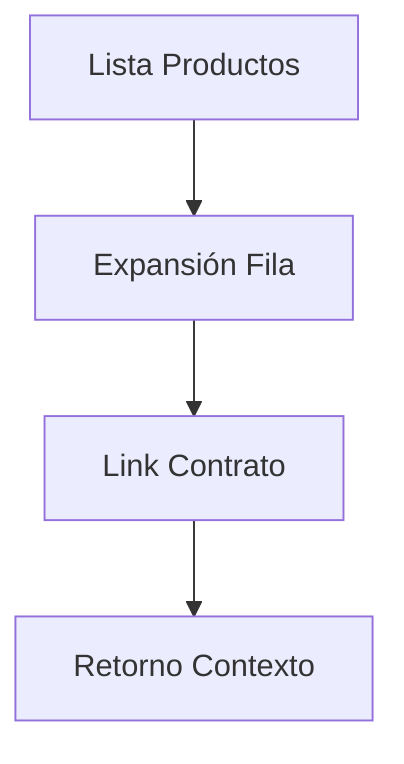

# Necesidades y Alcance

## 1. Resumen
Fase 2: Cierre de ciclo operativo-financiero. Foco en facturacion precisa y visibilidad de activos.

## 2. Objetivos de Negocio
- **Corte de Facturación**: Cobro sistematico por días definidos.
- **Sincronización BAAN**: Integración de estados de factura.
- **Trazabilidad de Activos**: Historial de contratos desde la lista de productos.

## 3. Alcance (Frentes de Valor)

### A. Facturación (Corte y Devolución)
- Regla de negocio para disparar facturas borrador.
- Cálculo automático de periodos remanentes en devoluciones.
- Intercambio de estados Odoo <-> BAAN (Borrador, En Revisión, Confirmada).

### B. UX y Productos
- Filas expandibles en `Pumps` y `Hoses/Accessories`.
- Acceso directo a contratos relacionados.
- Retorno automático al contexto previo (foco en lista).

## 4. Resultados Esperados
- Reducción de pasos manuales en facturación.
- Eliminación de errores por doble cobro.
- Respuestas inmediatas sobre disponibilidad e historial de equipos.

## 5. Flujos Clave

### Facturación

### Historial

